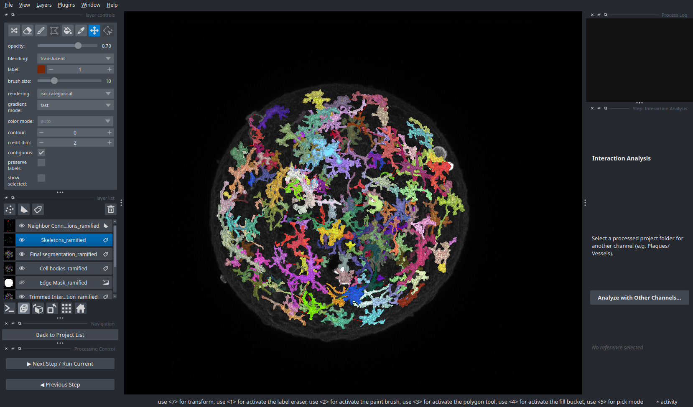

# HIBACHI
### Heuristic-Informed Batch Analysis for Cell Histological Identification

**HIBACHI** is a modular application designed for the automated segmentation, separation, and analysis of cells in large 2D and 3D microscopy datasets. It utilizes memory mapping and chunked processing to handle large volumes, while employing heuristic graph-based algorithms to separate complex, touching cell structures.

## 🚀 Key Features

*   **Memory Management:** Uses `numpy.memmap` and `dask` to process datasets that exceed physical RAM.
*   **Robust Separation:** Solves the "clumped cell" problem using a custom graph-based merge algorithm that analyzes geometric "necks" and intensity valleys.
*   **Batch Processing:** "Set and Forget" automated processing of entire experiment folders with crash recovery and resume capability.
*   **Interactive GUI:** Built on **Napari** and **PyQt5** for visualizing results and tuning parameters step-by-step.
*   **Modular Workflow:** 6-step pipeline covering everything from raw signal enhancement to multi-channel interaction analysis.

---

## 📸 Visual Examples

<p align="center">
  
  <br>
  <em>Figure 1: Automated 3D segmentation of ramified microglia (colored labels) with closest neighbor (red lines) overlay.</em>
</p>

---

## 🛠️ Installation

### Prerequisites
*   **Anaconda** or **Miniconda** installed on your system.
*   **Git** (optional, to clone the repo).

### 1. Clone the Repository
```bash
git clone https://github.com/chesnov/HIBACHI.git
cd HIBACHI
```

### 2. Create the Environment
An `environment.yaml` file contains all necessary dependencies (Napari, SimpleITK, Dask, etc.).

```bash
# Create the environment from the file
conda env create -f environment.yaml
```

### 3. Run the Application
```bash
# Activate the environment
conda activate hibachi

python segment.py
```

---

## 📂 Data Preparation & Project Structure

To use the **Batch Processor** and **Automatic Initialization**, your data must be organized specifically.

### 1. Input Directory
Place all your raw images in a single folder. Do not create subfolders yet.
*   **Supported Formats:** `.tif`, `.tiff`, `.czi` (Carl Zeiss Image).

### 2. Metadata (Dimensions)
HIBACHI requires physical dimensions (voxel size in microns) to perform accurate segmentation. It determines these using the following hierarchy:

1.  **CZI Files:** Metadata is automatically extracted from the file header.
2.  **OME-TIFF Files:** Metadata is extracted from the OME-XML header or standard TIFF resolution tags.
3.  **Fallback CSV:** If your TIFFs are missing metadata or if you want to override the detected values, provide a `metadata.csv` in the input folder.

**Optional CSV Format:**

| Filename | Width (um) | Height (um) | Depth (um) |
| :--- | :--- | :--- | :--- |
| `image_01.tif` | 1024.5 | 1024.5 | 50.0 |
| `image_02.tif` | 512.0 | 512.0 | 20.0 |

*   **Width/Height (um)**: Total physical length of the image in X and Y.
*   **Depth (um)**: Total physical depth (Z-axis). For 2D images, use 0.

### 3. Automatic Initialization
When you load this folder in the GUI for the first time:
1.  HIBACHI will detect the flat structure.
2.  It will ask to **Organize** the project.
    *   *Note:* If using `.czi` or multi-channel `.tif` files, it will ask which channel you wish to extract and analyze.
3.  It will move (or extract) every image into its own subfolder (e.g., `./image_01/image_01.tif`).
4.  It will generate a `processing_config.yaml` for each image, pre-filled with the voxel dimensions detected from the file or the CSV.

---

## 🧠 Processing Workflow

The pipeline consists of 6 modular steps. You can tune parameters for each step via the GUI sidebar.

1.  **Raw Segmentation:** Uses Hessian filters (Frangi/Sato) to detect tubular structures and global thresholding for volume.
2.  **Edge Trimming:** Generates a convex hull around the tissue and removes artifacts caused by edge damage/fluorescence.
3.  **Soma Extraction:** "Peels" the binary mask using iterative erosion to find the core seeds (cell bodies) within dense clumps.
4.  **Cell Separation:** Uses the seeds from Step 3 to perform a Marker-Controlled Watershed on the remaining mask, followed by a graph-based merge to fix over-segmentation.
5.  **Feature Calculation:** Computes Volume/Area, Shape factors, Skeleton/Ramification stats, and Pairwise Distances.
6.  **Interaction Analysis:** Analyzes spatial overlap and distance between the segmented cells and a reference channel (e.g., Plaques, Vessels).

---

## 📚 Documentation (Wiki)

Detailed documentation for the architecture, logic, and parameter tuning of each module can be found in the `wiki/` folder.

### Core Application
*   **[Entry Point (segment.py)](wiki/segment.md):** Application bootstrap and error handling.
*   **[GUI Manager (gui_manager.py)](wiki/gui_manager.md):** Manages the sidebar interactions and state.
*   **[Batch Processor (batch_processor.py)](wiki/batch_processor.md):** Logic for iterating over folders and managing headless processing.
*   **[Strategies (processing_strategies.py)](wiki/processing_strategies.md):** The controller logic managing data flow between steps.

### The Pipeline (Step-by-Step)
*   **[Step 1: Raw Segmentation](wiki/initial_segmentation.md):** Tubular enhancement and thresholding logic.
*   **[Step 2: Edge Trimming](wiki/remove_artifacts.md):** Convex hull and boundary cleaning.
*   **[Step 3: Soma Extraction](wiki/soma_extraction.md):** **(Read for Tuning)** How to detect cell seeds.
*   **[Step 4: Cell Separation](wiki/cell_splitting.md):** **(Read for Tuning)** How to split touching cells and fix straight-line artifacts.
*   **[Step 5: Features](wiki/calculate_features.md):** Metrics, skeletonization, and distance mapping.
*   **[Step 6: Interactions](wiki/interaction_analysis.md):** Multi-channel overlap and proximity analysis.

### Utilities
*   **[Helpers (segmentation_helpers.py)](wiki/segmentation_helpers.md):** Shared math and system utilities.

---

## 📄 Outputs

For every image, the following files are generated in `image_folder/image_name_processed_MODE/`:

*   `final_segmentation_*.dat`: The final integer label mask (Memmap).
*   `metrics_df_*.csv`: Spreadsheet containing Volume, Depth, Shape, Neighbor, and Skeleton stats per cell.
*   `skeleton_array_*.dat`: Visualization of the 1-pixel skeletons.
*   `cell_bodies.dat`: Intermediate mask of detected seeds.
*   `points_matrix_*.csv`: Data used to draw neighbor connection lines.
*   `interaction_*.csv`: Statistics regarding overlap with reference channels.
*   `processing_config_*.yaml`: A record of the exact parameters used for this run.